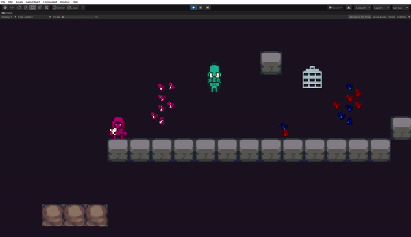

# FDV-fisicas

## Actividad Fisicas

Incorpora elementos físicos en tu escena que respondan a las siguientes restricciones:
- Objeto estático que ejerce de barrera infranqueable.
El piso gris es un rigidbody estático
- Zona en la que los objetos que caen en ella son impulsados hacia adelante.
la zona inferior izquierda se le asignó un material con "bounciness" para que los objetos reboten.
- Objeto que es arrastrado por otro a una distancia fija.
Se le colocó un distance joint a la jaula con respecto a roca flotando.
- Objeto que al colisionar con otros sigue un comportamiento totalmente físico.
Los personajes diminutos tienen fisicas simuladas.
- Incluye dos capas que asignes a diferentes tipos de objetos y que permita evitar colisiones entre ellos.
Se crearon dos capas azul y rojo y se modificó el collision matrix del proyecto para que no colisionen entre ellos, solo colisionan con su mismo color.
